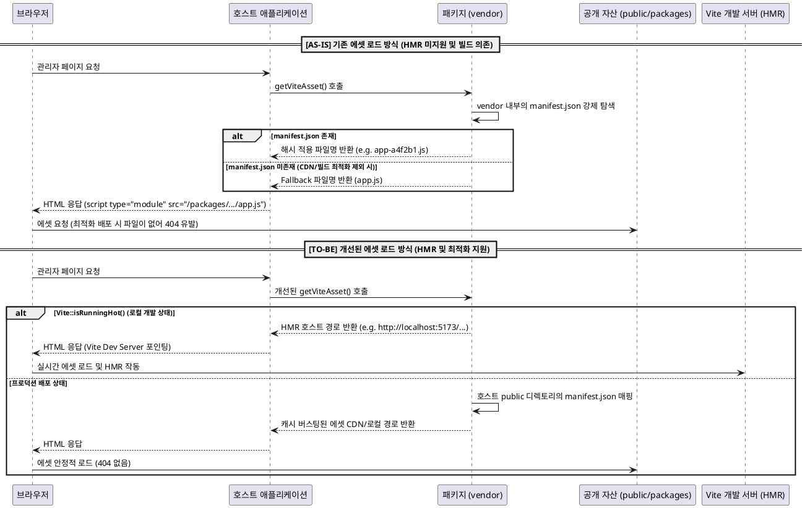
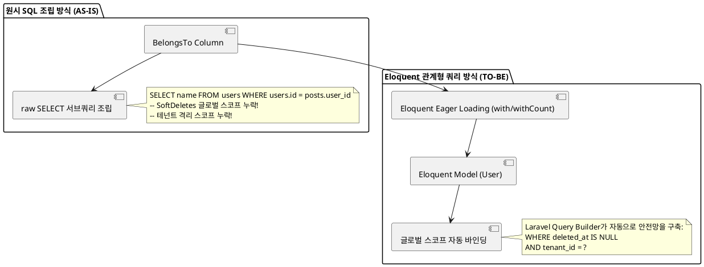
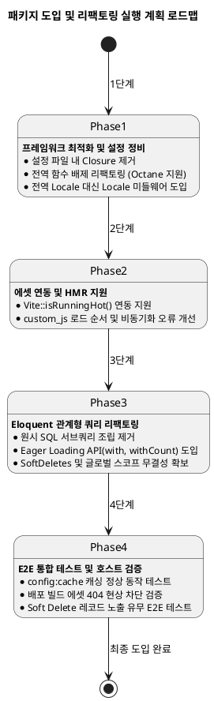

# 패키지 도입 타당성 분석 보고서: `saaksin/laravel-administrator`

본 보고서는 `saaksin/laravel-administrator` 패키지를 호스트 애플리케이션에 도입할 때 발생할 수 있는 프레임워크 호환성, 설정 구조, 다국어 처리, 에셋 배포 및 데이터베이스 쿼리 무결성 등의 마찰 요인을 면밀히 분석하고, 이를 해결하여 안정적으로 도입하기 위한 기술적 개선 방향과 구체적인 실행 계획을 제시합니다.

---

## 1. 요약 (Executive Summary)

* **도입 적합성 종합 의견**: **현 상태로의 즉각적인 도입은 부적합(Non-adoptable)하며, 구조적 리팩토링이 선행되어야 합니다.**
* **진단 결과**: 본 패키지는 Laravel 10 환경에서 Eloquent 모델 관리를 편리하게 돕는 유용한 도구이지만, 현대적인 라라벨 최적화 기법(설정 캐싱 등) 및 배포 파이프라인과의 심각한 아키텍처 충돌 요인을 내포하고 있습니다.
* **핵심 마찰 요인**:
  1. **설정 캐싱 차단**: 설정 파일 내 클로저(Closure) 정의로 인해 `php artisan config:cache` 적용 불가.
  2. **롱러닝 런타임 호환 불가**: 설정 파일 명칭과 동일한 전역 함수 호출 구조로 인한 네임스페이스 충돌 및 Laravel Octane/Swoole 환경에서의 구동 불능.
  3. **전역 로케일 간섭**: 세션 기반의 로케일 변경 처리 시 애플리케이션의 전역 로케일을 오버라이드하여 호스트 서비스 전체의 다국어 렌더링 오작동 유발.
  4. **에셋 연동 장애**: vendor 내 `manifest.json` 경로를 런타임에 직접 스캔/파싱하는 하드코딩된 구조로 인한 호스트의 빌드 에셋 최적화 시 404 오류 유발 및 HMR(Hot Module Replacement) 지원 차단.
  5. **데이터 무결성 결함**: 관계형 쿼리 처리 시 Eloquent 표준 API 대신 원시 SQL 서브쿼리를 직접 조립하여 `SoftDeletes` 글로벌 스코프나 테넌트 격리 정책이 무시됨.
* **결론 및 제안**: 패키지를 포크(Fork)하거나 내부 구조 개선을 적용하는 **4단계 마일스톤 실행 계획**을 통해, 설정 구조 정비, 로케일 격리, Vite HMR 지원, Eloquent 쿼리 리팩토링을 완료한 후 도입할 것을 권장합니다.

---

## 2. 호환성 및 충돌 가능성 분석 결과

### 2.1 PHP 및 Laravel 프레임워크 버전 제한
* **종속성 고정**: `composer.json`에 `laravel/framework: 10.*` 및 `php: >=8.1`로 엄격히 제한되어 있습니다.
* **버전 충돌**: 호스트 애플리케이션이 Laravel 11 이상의 최신 프레임워크를 사용 중이거나 향후 업그레이드를 계획하는 경우, 의존성 충돌로 인해 패키지 설치 자체가 거부됩니다.
* **프레임워크 내부 API 의존성**: `src/SaAkSin/Administrator/Validator.php`에서 라라벨 내부 클래스인 `ValidationRuleParser`를 직접 인스턴스화하여 사용하고 있어, 프레임워크의 마이너 패치 시 시그니처 변경에 의해 오작동할 잠재적 위험이 있습니다.

### 2.2 설정 파일 내 익명 함수(Closure) 사용으로 인한 설정 캐싱 차단
* **현상**: `src/config/administrator.php`의 `permission` 옵션 등에서 익명 함수(Closure)를 직접 반환하고 있습니다.
  ```php
  'permission'=> function()
  {
      return auth()->check();
  },
  ```
* **영향**: Laravel은 부팅 성능을 높이기 위해 모든 설정을 직렬화하여 하나의 파일로 결합하는 `php artisan config:cache` 명령어를 지원합니다. 설정 내에 클로저가 포함된 경우 직렬화가 불가능하므로, 빌드/배포 파이프라인에서 설정 캐싱 작업을 수행할 때 심각한 직렬화 에러를 유발합니다.

### 2.3 전역 함수 명칭 호출 구조로 인한 네임스페이스 충돌 및 롱러닝 런타임 호환 불가
* **현상**: `src/SaAkSin/Administrator/Config/Factory.php`에서 설정 파일의 파일명과 동일한 전역 함수를 정의하고 호출합니다.
  ```php
  require_once $path;
  $options = call_user_func($name); // 설정 파일 명칭에 해당하는 전역 함수 실행
  ```
* **영향**:
  - **이름 충돌**: 호스트 애플리케이션의 헬퍼 함수나 다른 라이브러리에서 동일한 이름의 전역 함수를 사용할 경우, 중복 정의 에러(`Cannot redeclare [function_name]`)를 유발하며 프로세스가 종료됩니다.
  - **Octane/Swoole 롱러닝 런타임 호환 불가**: 상태 비저장(Stateless) 방식이 아닌 롱러닝 프로세스 환경에서는 메모리 상에 전역 함수 및 로드된 상태가 누적되거나 덮어씌워져, 요청 간 격리가 깨지고 메모리 오염이나 예기치 않은 오작동이 고착화됩니다.

### 2.4 세션 기반 로케일 변경의 전역 간섭 문제
* **현상**: `AdministratorServiceProvider.php`의 부팅 라이프사이클에서 관리자 페이지 세션을 확인하여 호스트 애플리케이션의 전역 로케일을 오버라이드합니다.
  ```php
  public function setLocale()
  {
      if ($locale = $this->app->session->get('administrator_locale'))
      {
          $this->app->setLocale($locale); // 전역 로케일 강제 설정
      }
  }
  ```
* **영향**: 관리자 페이지에서 다국어 설정을 변경하는 세션 동작이 발생하는 순간, 일반 사용자가 접근하는 호스트 애플리케이션의 모든 사용자 페이지 영역까지 강제로 해당 언어로 변경되는 전역 오버라이드 현상이 발생합니다.

---

## 3. 에셋(Vite) 및 데이터베이스 마찰 요인 분석

### 3.1 런타임 내 vendor manifest.json 스캔 구조와 HMR 미지원
* **현상**: `src/viewComposers.php` 내의 `getViteAsset()` 헬퍼는 패키지가 설치된 `vendor` 내부 디렉토리를 기준으로 `manifest.json` 파일을 강제 검색하고 파싱합니다.
  ```php
  $manifestPath = __DIR__ . '/../public/dist/.vite/manifest.json';
  if (!file_exists($manifestPath)) {
      $manifestPath = __DIR__ . '/../public/dist/manifest.json';
  }
  ```
* **마찰 요인**:
  - **빌드/배포 최적화 시 404 오류**: 호스트 애플리케이션의 배포 시 `vendor` 디렉토리를 프로덕션 배포 이미지에서 최적화 제외하거나, 에셋을 외부 CDN이나 별도 스토리지로 분리하여 퍼블리싱할 때 manifest 파일을 로드하지 못하게 됩니다. 이 경우 해시명이 변경된 캐시 버스팅 파일을 찾지 못해 fallback 경로(`dist/js/app.js`)를 뱉어내며 브라우저에서 404 에러를 발생시킵니다.
  - **HMR(Hot Module Replacement) 지원 차단**: 로컬 개발 시 호스트 애플리케이션과 실시간 연동되지 않아, 패키지 프론트엔드 자산을 수정할 때마다 매번 수동 빌드 및 `vendor:publish` 단계를 거쳐야 하므로 극심한 개발 생산성 저하를 유발합니다.



### 3.2 ES Modules(`type="module"`)과 호스트 custom_js 간의 순서 마찰
* **현상**: 레이아웃 파일 `default.blade.php`에서 에셋은 `type="module"`을 사용하여 비동기(deferred)로 로딩되나, 관리자가 설정한 `custom_js`는 동기식 스크립트로 즉시 로드됩니다.
* **문제점**: 브라우저 렌더링 시 `custom_js` 내부의 레거시 스크립트가 Alpine.js 모듈(ESM)보다 먼저 로드되어 실행 순서가 엉킴으로써, `Alpine is not defined` 등의 스크립트 런타임 에러가 발생합니다.

### 3.3 원시 SQL 서브쿼리 직접 조립 및 데이터 무결성 결함
* **현상**: `BelongsTo.php`와 같은 관계형 데이터를 수집하고 정렬할 때, Eloquent의 정석적인 관계형 쿼리 구조(Eager Loading 등)를 사용하지 않고, SQL 문자열 조인을 통해 직접 서브쿼리를 조립합니다.
  ```php
  $selects[] = $this->db->raw("(SELECT " . $this->getOption('select') . "
                                  FROM " . $from_table." AS " . $field_table . ' ' . $joins . "
                                  WHERE " . $where . ") AS " . $this->db->getQueryGrammar()->wrap($columnName));
  ```
* **데이터 무결성 결함 (심각)**:
  - **글로벌 스코프 누락**: 날것의 SQL 조립 형태이기 때문에, 연결된 관계 대상 모델에 설정된 `SoftDeletes` 글로벌 스코프(`deleted_at IS NULL`)나 테넌트 격리 필터(`tenant_id = ?`)가 쿼리 내부로 주입되지 못합니다.
  - **부작용**: 관리자 페이지 내에서 **이미 휴지통으로 이동(논리 삭제)한 레코드가 버젓이 노출되거나, 다른 테넌트(고객사)의 비공개 데이터가 오버랩되는 데이터 누출 및 무결성 침해** 현상이 야기됩니다.
  - **DB 호환성 문제**: SQL 문법(따옴표, 키워드 등)을 하드코딩하므로 PostgreSQL, SQLite 등 다양한 DB 드라이버 사용 시 구문 파싱 오류를 유발합니다.



---

## 4. 문제점 극복을 위한 기술적 개선 제안 (코드 수정 가이드라인)

### 4.1 설정 구조 개선 (Closure 제거 및 전역 함수 배제)
* **익명 함수(Closure) 제거**:
  `config/administrator.php` 내의 `permission` 등의 옵션에 클로저 대신 **클래스명 문자열**이나 **Gate 이름**을 기입하도록 개선합니다.
  ```php
  // AS-IS
  'permission' => function() { return auth()->check(); },

  // TO-BE
  'permission' => App\Admin\Security\AdminPermissionChecker::class,
  // 또는 Laravel 기본 Gate 호출 명칭 지정
  'permission' => 'access-admin',
  ```
  패키지 런타임에서는 주입된 설정을 바탕으로 컨테이너에서 클래스를 Resolve하여 판단 로직을 처리하도록 변경합니다:
  ```php
  $checker = app($config['permission']);
  if ($checker instanceof PermissionCheckerInterface) {
      return $checker->check();
  }
  ```
* **전역 함수 배제**:
  설정 파일을 로드할 때 전역 함수 명칭으로 호출하는 기존 팩토리 구조를 폐기하고, 라라벨의 일반 설정 배열 형태를 유지하여 **Laravel Octane 및 Swoole 메모리 격리 환경에 완벽 대응**하도록 조치합니다.

### 4.2 로케일 제어 격리 (Middleware 적용)
* **미들웨어 기반 격리**:
  `ServiceProvider` 레벨에서 전역 `app()->setLocale()`을 강제하는 부분을 삭제하고, 관리자 라우트 그룹(`config('administrator.uri')`)에만 전용 HTTP 미들웨어(`AdministratorLocaleMiddleware`)를 정의하여 할당합니다.
  ```php
  namespace SaAkSin\Administrator\Middleware;

  use Closure;
  use Illuminate\Http\Request;

  class AdministratorLocaleMiddleware
  {
      public function handle(Request $request, Closure $next)
      {
          if ($locale = $request->session()->get('administrator_locale')) {
              app()->setLocale($locale); // 해당 HTTP 요청 주기 내에서만 로케일 격리
          }
          return $next($request);
      }
  }
  ```

### 4.3 Vite 에셋 및 HMR 개선
* **Vite 로컬 개발 환경(HMR) 지원**:
  `getViteAsset` 헬퍼가 단순히 패키지 vendor 내의 파일 유무만 판별하지 않고, 라라벨 Vite 파사드의 `Vite::isRunningHot()`을 활용해 로컬 개발 모드 시 적절한 개발 서버 주소로 포인팅하도록 헬퍼를 리팩토링합니다.
* **에셋 순서 제어**:
  `custom_js` 설정으로 등록된 레거시 스크립트들이 Alpine.js 및 Vite ESM 모듈보다 먼저 로드되어 스크립트 오류를 내지 않도록, `default.blade.php` 템플릿의 스크립트 배치 구조 및 defer/type 속성을 일관되게 정비합니다.

### 4.4 관계형 쿼리 리팩토링 (Eloquent API 전환)
* **원시 SQL 조립 차단**:
  관계형 데이터 추출을 위해 `SELECT` 쿼리를 문자열로 꿰어 맞추는 임의 조립부를 전면 철폐합니다.
* **Eloquent Eager Loading 활용**:
  라라벨 공식 API인 `with()` 및 `withCount()`를 활용해 데이터 로드를 수행함으로써, 관계 모델의 `SoftDeletes` 글로벌 스코프(`deleted_at IS NULL`) 및 테넌트 격리 정책이 자연스럽게 상속 및 반영되도록 코드를 리팩토링합니다.

---

## 5. 실제 적용을 위한 구체적인 마일스톤 및 실행 계획



### 1단계: 프레임워크 최적화 및 설정 구조 정비
* **목표**: 라라벨 최적화 도구 호환성 100% 확보 및 롱러닝 런타임 격리 안정화.
* **실행 사항**:
  - 설정 파일의 `permission` 속성을 검증용 Gate 또는 클래스명 문자열로 전환.
  - `Factory.php`의 `call_user_func` 전역 함수 실행부를 Laravel 설정 배열 구조로 교체.
  - 전역 Locale 덮어쓰기 로직을 삭제하고 관리자 라우트 전용 로케일 격리 미들웨어 구현.

### 2단계: 에셋 연동 및 HMR 지원
* **목표**: 에셋 로딩 404 해결 및 로컬 개발 핫 리로드(HMR) 활성화.
* **실행 사항**:
  - `getViteAsset` 메소드 내에 `Vite::isRunningHot()` 분기 처리 및 개발 서버 URL 연결 구현.
  - HTML 에셋 출력 시 `type="module"`과 호스트의 `custom_js` 간의 브라우저 로딩 순서 교정.

### 3단계: Eloquent 관계형 쿼리 리팩토링
* **목표**: 데이터 누출 및 정밀 조회 오작동 해결을 위한 쿼리 아키텍처 개편.
* **실행 사항**:
  - `BelongsTo` 등 모든 관계형 컬럼에 대한 수동 SQL 문자열 조립 로직 전면 제거.
  - 관계 대상 모델의 Eloquent 데이터 처리를 Eager Loading(`with`, `withCount`) 구조로 재조정하여 `SoftDeletes` 및 글로벌 격리 스코프 연동 보장.

### 4단계: E2E 통합 테스트 및 호스트 애플리케이션 실제 통합 검증
* **목표**: 도입 전 안정성 최종 승인 및 부작용 0% 달성.
* **실행 사항**:
  - `php artisan config:cache` 명령을 실행해 설정 캐싱 직렬화가 오류 없이 통과하는지 확인.
  - 로컬 개발 환경에서 Vite 소스 수정 시 브라우저에서 HMR이 원활히 동작하는지 확인.
  - 관계 모델을 소프트 삭제해 보고, 관리자 화면의 목록 및 상세 검색 드롭다운에서 노출이 안전하게 필터링되는지 최종 검증.
