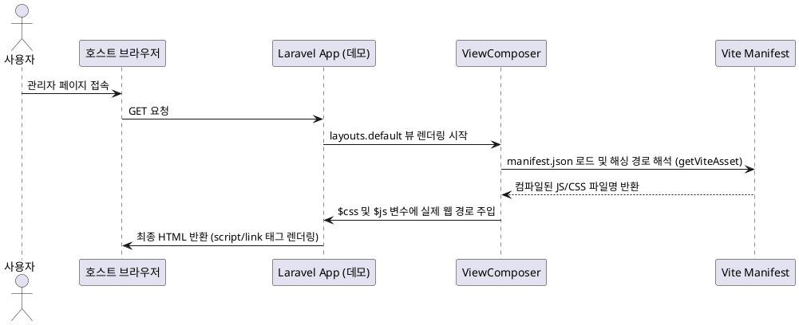

# Laravel Administrator 패키지 개발 가이드

이 가이드는 `SaAkSin\Administrator` 패키지의 내부 아키텍처 구조를 파악하고, 로컬 개발 환경에서의 실시간 연동 셋업, PHPUnit 테스트 검증, 그리고 Vite 및 NPM을 이용한 프론트엔드 에셋 빌드와 배포 프로세스를 효과적으로 수행할 수 있도록 돕기 위해 작성되었습니다.

---

## 목차
1. [패키지 아키텍처 및 소스 구조](#1-패키지-아키텍처-및-소스-구조)
   - 1.1. 서비스 프로바이더 (ServiceProvider)
   - 1.2. 라우팅 (Routing) 및 미들웨어
   - 1.3. 컨트롤러 (Controller)
   - 1.4. 설정 (Config), 뷰 (Views) 및 에셋 매핑 구조
2. [로컬 실시간 개발 연동 셋업 가이드](#2-로컬-실시간-개발-연동-셋업-가이드)
   - 2.1. 데모 프로젝트 설정 (composer.json)
   - 2.2. 로컬 패키지 Symlink 연동 및 업데이트
3. [테스트 검증 방법](#3-테스트-검증-방법)
   - 3.1. 패키지 자체 PHPUnit 테스트
   - 3.2. 데모 프로젝트 PHPUnit 테스트
4. [에셋 빌드 및 배포 가이드](#4-에셋-빌드-및-배포-가이드)
   - 4.1. Vite 및 NPM 빌드 프로세스
   - 4.2. 정적 자산 로드 흐름 (Vite Manifest & ViewComposer)
   - 4.3. 호스트 애플리케이션으로의 배포 (vendor:publish)

---

## 1. 패키지 아키텍처 및 소스 구조

`SaAkSin\Administrator` 패키지는 데이터베이스를 기반으로 Laravel 호스트 애플리케이션에 관리자 페이지(CRUD, 설정 페이지 등)를 동적으로 제공하는 패키지입니다. 전체 소스 구조는 Laravel 표준 패키지 구조를 따르고 있으며, 핵심 구성 요소들은 다음과 같습니다.

### 1.1. 서비스 프로바이더 (ServiceProvider)
* **파일 경로**: `src/SaAkSin/Administrator/AdministratorServiceProvider.php`
* **주요 역할**: 
  - **부트스트랩 (boot)**:
    - `loadViewsFrom()`을 호출하여 `views` 템플릿 경로를 `administrator` 네임스페이스로 바인딩합니다.
    - `mergeConfigFrom()`을 통해 패키지 내부의 기본 설정 파일(`config/administrator.php`)을 호스트의 `administrator` 설정으로 병합합니다.
    - `loadTranslationsFrom()`을 통해 `lang` 폴더 내 다국어 번역 파일들을 연동합니다.
    - `publishes()` 메소드를 사용하여 호스트 애플리케이션이 `php artisan vendor:publish` 명령어를 실행할 때 설정 파일 및 `public` 에셋(빌드된 CSS, JS 등)을 퍼블리싱할 수 있도록 등록합니다.
  - **서비스 등록 (register)**:
    - 라우팅 파일(`routes.php`) 및 뷰 컴포저(`viewComposers.php`)를 인클루드하여 애플리케이션이 부트될 때 연동되도록 합니다.
    - 패키지 내에서 유효성 검사, 설정 팩토리, 필드 팩토리, 쿼리 및 데이터 테이블 처리, 컬럼 및 액션 팩토리를 담당하는 싱글톤 객체들(`admin_validator`, `admin_config_factory`, `admin_field_factory`, `admin_datatable`, `admin_column_factory`, `admin_action_factory`, `admin_menu`)을 Laravel 서비스 컨테이너에 등록합니다.

### 1.2. 라우팅 (Routing) 및 미들웨어
* **파일 경로**: `src/routes.php`
* **라우팅 구조**:
  - 호스트 애플리케이션의 설정(`administrator.uri`, `administrator.domain`)과 미들웨어를 동적으로 읽어 라우트 그룹을 생성합니다.
  - 기본적으로 패키지가 기본 제공하는 `ValidateAdmin` 미들웨어가 최상위 그룹에 적용됩니다.
  - **주요 라우트 매핑**:
    - 대시보드: `GET /` -> `AdminController@dashboard`
    - 커스텀 페이지: `GET /page/{page}` -> `AdminController@page`
    - 설정 페이지 그룹 (`ValidateSettings`, `PostValidate` 미들웨어 적용):
      - `GET /settings/{settings}` -> `AdminController@settings` (설정 뷰 출력)
      - `POST /settings/{settings}/save` -> `AdminController@settingsSave` (설정 저장)
      - `POST /settings/{settings}/custom_action` -> `AdminController@settingsCustomAction` (설정 커스텀 액션 실행)
    - 모델 관리 CRUD 그룹 (`ValidateModel`, `PostValidate` 미들웨어 적용):
      - `GET /{model}` -> `AdminController@index` (데이터 테이블 뷰)
      - `POST /{model}/results` -> `AdminController@results` (JSON 데이터 반환)
      - `GET /{model}/new` -> `AdminController@item` (신규 생성 폼)
      - `GET /{model}/{id}` -> `AdminController@item` (수정 폼)
      - `POST /{model}/{id?}/save` -> `AdminController@save` (신규 생성 또는 수정 내용 저장)
      - `POST /{model}/{id}/delete` -> `AdminController@delete` (삭제)
* **핵심 미들웨어 (`src/SaAkSin/Administrator/Http/Middleware/` 하위)**:
  - `ValidateAdmin`: 현재 사용자가 관리자 페이지에 접근할 권한이 있는지 검증합니다.
  - `ValidateModel`: 요청된 모델명이 설정에 정의된 유효한 모델 설정인지 확인하고 `itemconfig` 인스턴스를 바인딩합니다.
  - `ValidateSettings`: 요청된 설정명이 설정에 정의된 유효한 설정인지를 확인합니다.
  - `PostValidate`: 요청 데이터 유효성 검사 등을 후처리합니다.

### 1.3. 컨트롤러 (Controller)
* **파일 경로**: `src/controllers/AdminController.php` (네임스페이스 `SaAkSin\Administrator`)
* **주요 역할**:
  - 관리자 레이아웃인 `administrator::layouts.default` 템플릿을 기반으로 뷰를 구성합니다.
  - 폼 요청 에러 해석(`resolveDynamicFormRequestErrors`)을 통해 호스트에서 설정된 `FormRequest` 유효성 검사 오류를 JSON 형태의 응답으로 변환합니다.
  - CRUD 요청, 파일 업로드/다운로드, 다국어 전환(`switchLocale`) 및 사용자 정의 액션들을 통합 제어합니다.

### 1.4. 설정 (Config), 뷰 (Views) 및 에셋 매핑 구조
* **설정 (Config)**: `src/config/administrator.php` 파일에 기본 관리자 URI, 대시보드 사용 여부, 메뉴 구성, 다국어 세팅, 권한 검증 클로저 등이 정의되어 있습니다.
* **뷰 (Views)**: `src/views/` 폴더에 레이아웃 및 뷰가 있습니다.
  - `layouts/default.blade.php`: 최상위 레이아웃 템플릿. `$css` 및 `$js` 자산 목록을 주입받아 동적으로 스크립트와 스타일시트를 로드합니다.
  - `index.php`, `settings.php`: Knockout.js/Alpine.js 기반으로 프론트엔드가 반응형으로 동작하도록 컴포넌트 템플릿들이 결합되는 영역입니다.
* **에셋 매핑 구조**:
  - 개발 시 원본 리소스는 `resources/css`, `resources/js`, `resources/img`에 위치합니다.
  - Vite 번들러를 통해 빌드된 에셋들은 패키지 내 `public/dist/` 디렉토리에 버전별 해시명과 함께 생성되며, 빌드 메타데이터는 `public/dist/.vite/manifest.json`에 저장됩니다.

---

## 2. 로컬 실시간 개발 연동 셋업 가이드

패키지 소스 코드를 수정하면서 데모 프로젝트(`demo/laravel-administrator`)에서 즉시 확인하고 개발하기 위해 Composer의 `path` 리포지토리를 활용하여 심볼릭 링크(symlink) 형태로 연동합니다.

### 2.1. 데모 프로젝트 설정 (composer.json)
데모 프로젝트의 루트 디렉토리에 있는 `composer.json`을 열고 다음과 같이 설정합니다.

1. **`repositories` 섹션 추가**:
   데모 프로젝트에서 로컬 패키지 디렉토리를 참조할 수 있도록 `path` 타입의 리포지토리를 정의합니다. 이때 `options.symlink`를 `true`로 지정하여 실제 패키지 소스를 링크하도록 설정합니다.
   ```json
   "repositories": [
       {
           "type": "path",
           "url": "../../artgrammer/laravel-administrator",
           "options": {
               "symlink": true
           }
       }
   ]
   ```
   *참고: `url` 경로는 데모 프로젝트 루트 디렉토리 기준의 상대 경로입니다.*

2. **`require` 의존성 바인딩**:
   `require` 항목에 패키지 네임스페이스와 개발 브랜치를 지정합니다.
   ```json
   "require": {
       "php": "^8.1",
       "laravel/framework": "^10.10",
       "saaksin/laravel-administrator": "dev-main"
   }
   ```

### 2.2. 로컬 패키지 Symlink 연동 및 업데이트
설정이 완료되었으면 데모 프로젝트 루트에서 다음 명령어를 실행하여 연동을 처리합니다.

```bash
# 데모 프로젝트 루트 디렉토리에서 실행
composer update saaksin/laravel-administrator
```

이 명령어를 실행하면 Composer는 `vendor/saaksin/laravel-administrator` 폴더를 새로 다운로드하지 않고, 로컬 패키지 소스 디렉토리(`../../artgrammer/laravel-administrator`)에 대한 **심볼릭 링크**로 대체합니다. 

이후 패키지 내 소스 코드(PHP, Blade 파일 등)를 수정하면, 데모 프로젝트의 `vendor` 폴더에 실시간으로 반영되므로 로컬 연동 개발이 수월하게 진행됩니다.

---

## 3. 테스트 검증 방법

패키지와 데모 프로젝트는 각각의 독립된 PHPUnit 테스트 스위트를 포함하고 있습니다. 소스 수정 후에는 반드시 두 테스트 환경 모두 정상 통과하는지 확인해야 합니다.

### 3.1. 패키지 자체 PHPUnit 테스트
패키지 소스에는 주요 비즈니스 로직과 필드 팩토리, 유효성 검사기 등에 대한 단위 및 통합 테스트가 포함되어 있습니다.
* **실행 위치**: 패키지 루트 디렉토리 (`/Users/galahan/SaAkSin/artgrammer/laravel-administrator`)
* **구동 명령어**:
  ```bash
  ./vendor/bin/phpunit
  ```
* **결과 요약**:
  총 276개의 테스트와 233개의 Assertion이 존재하며, 오류 없이 정상 동작합니다.
  ```text
  Time: 00:00.186, Memory: 34.00 MB
  OK (276 tests, 233 assertions)
  ```

### 3.2. 데모 프로젝트 PHPUnit 테스트
데모 프로젝트는 패키지가 실제 Laravel 프레임워크 환경에서 문제없이 동작하는지 검증하는 역할을 수행합니다.
* **실행 위치**: 데모 프로젝트 루트 디렉토리 (`/Users/galahan/SaAkSin/demo/laravel-administrator`)
* **구동 명령어**:
  ```bash
  ./vendor/bin/phpunit
  ```
* **결과 요약**:
  데모 애플리케이션의 핵심 라우트와 환경 검증을 위한 2개의 테스트가 실행되며, 정상 통과합니다.
  ```text
  Time: 00:00.143, Memory: 24.00 MB
  OK (2 tests, 2 assertions)
  ```

---

## 4. 에셋 빌드 및 배포 가이드

패키지는 현대적인 Alpine.js와 Tailwind CSS를 사용하며, 프론트엔드 빌드 도구로 Vite를 활용합니다. 빌드된 에셋이 호스트 애플리케이션으로 로드되는 전반적인 흐름은 다음과 같습니다.

### 4.1. Vite 및 NPM 빌드 프로세스
프론트엔드 자산을 수정하거나 릴리즈할 때는 패키지 루트에서 에셋을 재컴파일해야 합니다.

* **설정 파일 (`vite.config.js`)**:
  - `outDir`을 `public/dist`로 설정하여 컴파일 결과물이 패키지 루트의 public 폴더에 모이도록 설계되었습니다.
  - `manifest: true` 설정을 통해 빌드된 파일의 해시 매핑 메타데이터가 `.vite/manifest.json`에 저장됩니다.
  - `base` 경로를 `/packages/saaksin/administrator/dist/`로 설정하여 퍼블리싱된 환경에서 폰트나 이미지 등 상대 경로 리소스가 깨지지 않고 안전하게 로드되도록 제방합니다.
* **빌드 명령어 (패키지 루트에서 실행)**:
  ```bash
  # 의존성 설치 (최초 1회)
  npm install
  
  # 프로덕션 빌드 실행
  npm run build
  ```

### 4.2. 정적 자산 로드 흐름 (Vite Manifest & ViewComposer)

Vite 빌드 결과물에는 캐시 버스팅을 위한 해시가 포함되어 있으므로, 런타임에 올바른 에셋 경로를 동적으로 결정해야 합니다. 패키지는 이 흐름을 다음과 같이 처리합니다.



1. **`getViteAsset` 헬퍼 함수 (`src/viewComposers.php`)**:
   - 패키지에 포함된 `public/dist/.vite/manifest.json`(Vite 5+) 또는 `manifest.json`(Vite 4 이하)을 읽어들입니다.
   - `resources/js/app.js` 키에 매핑된 실제 컴파일된 파일명(`js/app-DxFOnpv2.js` 등)을 획득합니다.
   - 획득한 파일명에 호스트 애플리케이션의 에셋 주소인 `packages/saaksin/administrator/dist/` 접두사를 붙여 실경로 URL을 생성합니다.
   - 동시에 이 JS 엔트리에 연관된 CSS 파일명이 존재할 경우, 자동으로 CSS 배열에 실경로 URL을 주입해 줍니다.
2. **`layouts.default` 뷰 컴포저**:
   - `viewComposers.php`에서 레이아웃 뷰가 렌더링될 때 `$view->css`와 `$view->js` 배열을 초기화하고, `getViteAsset()`을 호출해 빌드된 현대적인 스크립트와 스타일시트를 글로벌 배열에 등록합니다.
3. **Blade 템플릿 렌더링 (`layouts/default.blade.php`)**:
   - 레이아웃 파일 내부에서 루프를 돌며 CSS 링크 태그와 모듈형 스크립트 태그를 렌더링하여 최종 브라우저에 전달합니다.
   ```html
   <!-- CSS 로드 -->
   @foreach ($css as $url)
       <link href="{{$url}}" media="all" type="text/css" rel="stylesheet">
   @endforeach

   <!-- JS 로드 (Vite 앱 스크립트는 type="module" 필수) -->
   @foreach ($js as $key => $url)
       @if ($key === 'vite-app' || strpos($url, '/dist/js/app') !== false)
           <script type="module" src="{{$url}}"></script>
       @else
           <script src="{{$url}}"></script>
       @endif
   @endforeach
   ```

### 4.3. 호스트 애플리케이션으로의 배포 (vendor:publish)
패키지 자체에서 에셋을 빌드하더라도, 이는 패키지 내 `public/` 디렉토리에만 보관됩니다. 호스트 애플리케이션(데모 프로젝트 등) 웹 루트에서 접근할 수 있도록 하기 위해서는 자산을 배포하는 과정이 필요합니다.

* **ServiceProvider 등록**:
  `AdministratorServiceProvider::boot` 내에서 다음과 같이 퍼블리싱 태그가 지정되어 있습니다.
  ```php
  $this->publishes([
      __DIR__.'/../../../public' => public_path('packages/saaksin/administrator'),
  ], 'public');
  ```
* **에셋 배포 명령어**:
  정적 자산 코드가 수정되거나 새로 빌드된 후에는 데모 프로젝트 루트에서 다음 명령어를 실행하여 호스트 애플리케이션의 `public` 폴더로 에셋을 동기화시켜야 합니다.
  ```bash
  # 데모 프로젝트 루트에서 실행
  php artisan vendor:publish --tag=public --force
  ```
  이 명령을 통해 `public/packages/saaksin/administrator/dist/` 하위에 최종 빌드된 에셋들이 물리적으로 복사되며, 호스트의 웹 서버를 통해 클라이언트에 에셋들이 올바르게 전달됩니다.
