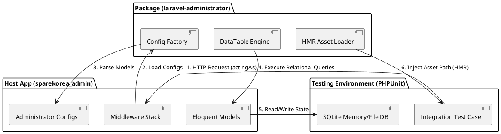

# TEST INFRASTRUCTURE (테스트 인프라 정의서)

본 문서는 `laravel-administrator` 패키지와 호스트 프로젝트(`sparekorea_admin`) 간의 통합 및 동작을 검증하기 위한 4-Tier 테스트 인프라와 E2E 테스트 아키텍처에 대해 기술합니다.

---

## 1. 테스트 방법론 및 철학

본 패키지의 테스트는 단순한 단위 테스트(Unit Test)를 넘어 호스트 프로젝트와의 유기적 연동 및 실제 운영 환경과 유사한 시나리오에서의 신뢰성을 검증하기 위해 **4-Tier 테스트 아키텍처**를 채택하였습니다. 

1. **최소 침습성**: 호스트 데이터베이스를 오염시키지 않고 격리된 SQLite 인메모리/파일 데이터베이스를 활용하여 검증합니다.
2. **호환성 보장**: Laravel 10 환경에서의 쿼리 빌더 빌딩(Subquery 등), 미들웨어 동작 및 HMR(Hot Module Replacement) 에셋 로딩을 밀착 검증합니다.
3. **영속성 및 캐시 대응**: 설정 캐싱(`config:cache`)이 적용된 상황에서도 세션 유실 및 DB 커넥션 불일치 없이 프레임워크가 원활하게 구동되는지 보장합니다.

---

## 2. 테스트 아키텍처 구조

아래 다이어그램은 본 테스트 환경의 전체적인 계층 및 흐름을 보여줍니다.



---

## 3. 대상 기능 및 4-Tier 테스트 범위

| 계층 (Tier) | 테스트 케이스명 | 설명 / 검증 목적 |
|---|---|---|
| **Tier 1: 기능 커버리지** | `test_tier1_hmr_asset_loading` | HMR 에셋이 존재할 때 대시보드 렌더링 시 적절한 스크립트 경로가 주입되는지 검증 |
| | `test_tier1_relationship_column_loading` | 벨롱스투(BelongsTo) 관계형 컬럼을 가진 유저 목록이 서브쿼리 바인딩 오염 없이 조회되는지 검증 |
| **Tier 2: 복합 기능 체인** | `test_tier2_complex_filtering_and_query` | 다중 필터(Boolean, Key 등) 조건 하에서 복합 데이터 검색 기능이 성공적으로 처리되는지 확인 |
| | `test_tier2_relationship_actions` | 회원 등급 등의 관계형 정보를 활용한 어드민 비즈니스 기능 동작 검증 |
| **Tier 3: 캐시 & 크로스 통합** | `test_tier3_cached_cross_integration` | `config:cache`가 적용되어 싱글톤들이 리빌드된 후에도 DB와 세션 정합성이 유지되는지 검증 |
| **Tier 4: 실전 E2E 시나리오** | `test_tier4_real_world_admin_scenario` | 일반 유저 생성, 회원 정보 관리자 페이지 조회, 데이터 정합성 확인에 이르는 종합 시나리오 검증 |

---

## 4. 테스트 구동 및 명령법

테스트는 호스트 프로젝트 디렉토리(`/Users/galahan/SaAkSin/artgrammer/sparekorea/web/admin`)에서 PHPUnit을 통해 구동됩니다.

### 전체 통합 테스트 실행
```bash
./vendor/bin/phpunit tests/Feature/AdministratorIntegrationTest.php
```

### 특정 Tier 테스트만 필터링하여 실행
```bash
./vendor/bin/phpunit --filter test_tier3_cached_cross_integration tests/Feature/AdministratorIntegrationTest.php
```
